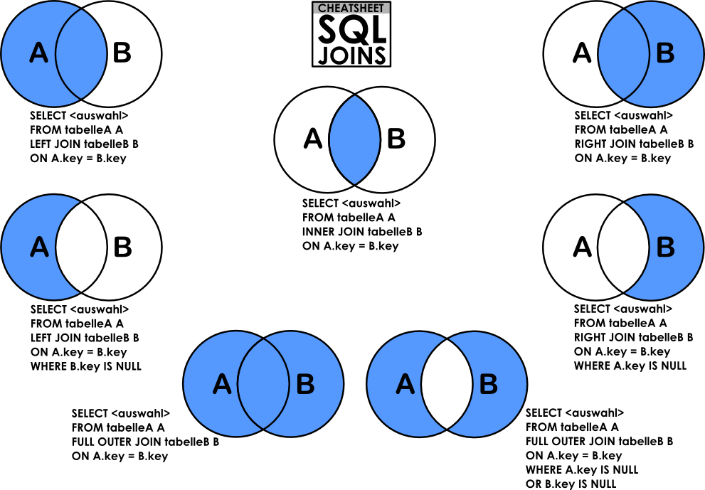

# SQL - More queries

**NOTE**: the first commit message of each file means create script (description) if create is not typed

## **RUN BY**:

    cat [files_3_to_9]| mysql -hlocalhost -uroot -p hbtn_0d_tvshows

    cat [files_10_to_101]| mysql -hlocalhost -uroot -p hbtn_0d_tvshows

## Resources:

[DB2 LINK](https://s3.amazonaws.com/intranet-projects-files/holbertonschool-higher-level_programming+/274/hbtn_0d_tvshows_rate.sql)

[cheat sheet](https://intellipaat.com/mediaFiles/2019/02/SQL-Commands-Cheat-Sheet.pdf?US)

[cheat sheet](https://www.newthinktank.com/2014/08/mysql-video-tutorial/)

[video](https://www.youtube.com/watch?v=yPu6qV5byu4)

## How to import a SQL dump:

```shell
$ echo "CREATE DATABASE hbtn_0d_tvshows;" | mysql -uroot -p

Enter password:

$ curl "https://s3.amazonaws.com/intranet-projects-files/holbertonschool-higher-level_programming+/274/hbtn_0d_tvshows.sql" -s | mysql -uroot -p hbtn_0d_tvshows

Enter password:
$ echo "SELECT \* FROM tv_genres" | mysql -uroot -p hbtn_0d_tvshows

Enter password:
id name
1 Drama
2 Mystery
3 Adventure
4 Fantasy
5 Comedy
6 Crime
7 Suspense
8 Thriller
$

```


