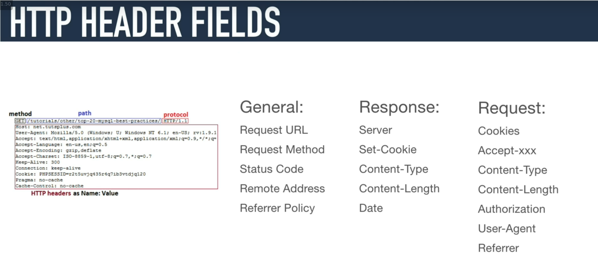
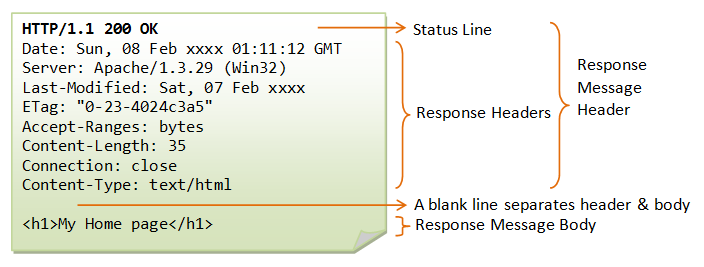
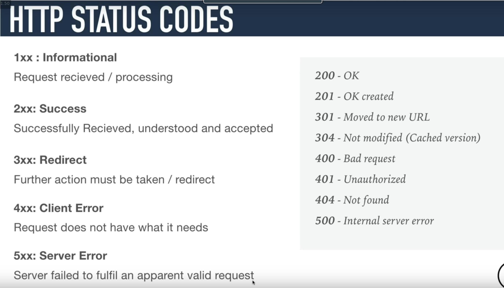

# Python - Network #0

## Resources:

> [HTTP (HyperText Transfer Protocol)](https://www3.ntu.edu.sg/home/ehchua/programming/webprogramming/HTTP_Basics.html)

> [HTTP Cookies](https://developer.mozilla.org/en-US/docs/Web/HTTP/Cookies)

## General

> What a URL is:

    Uniform Resource Locator (URL)

    A URL (Uniform Resource Locator) is used to uniquely identify a resource over the web. URL has the following syntax:

    protocol://hostname:port/path-and-file-name

> What HTTP is

    HTTP (Hypertext Transfer Protocol) is perhaps the most popular application protocol used in the Internet (or The WEB).

        HTTP is an asymmetric request-response client-server protocol as illustrated.  An HTTP client sends a request message to an HTTP server.  The server, in turn, returns a response message.  In other words, HTTP is a pull protocol, the client pulls information from the server (instead of server pushes information down to the client).
        HTTP is a stateless protocol. In other words, the current request does not know what has been done in the previous requests.

        HTTP permits negotiating of data type and representation, so as to allow systems to be built independently of the data being transferred.

> How to read a URL:

    in the URL http://www.nowhere123.com/docs/index.html

    the communication protocol is HTTP; the hostname is www.nowhere123.com. The port number was not specified in the URL, and takes on the default number, which is TCP port 80 for HTTP. The path and file name for the resource to be located is "/docs/index.html".

> The scheme for a HTTP URL
> 

> What a domain name is

> What a sub-domain is

> How to define a port number in a URL

> What a query string is

> What an HTTP request is

The first line of the header is called the request line, followed by optional request headers.

The request line has the following syntax:

**request-method-name request-URI HTTP-version**

The request headers are in the form of name:value pairs. Multiple values, separated by commas, can be specified.

**request-header-name: request-header-value1, request-header-value2, ...**

**example:**

> What an HTTP response is

    The response headers are in the form name:value pairs:

    response-header-name: response-header-value1, response-header-value2, ...

> What HTTP headers are

> What the HTTP message body is

> What an HTTP request method is

> What an HTTP response status code is

    The status line has the following syntax:

    HTTP-version status-code reason-phrase

> 

> What an HTTP Cookie is

> How to make a request with cURL

> What happens when you type google.com in your browser (Application
> level)>

---
